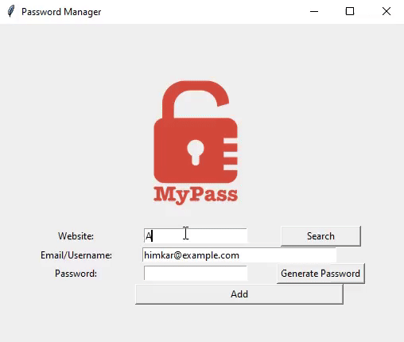

# Password Manager 🔐

A simple and efficient Password Manager built using Python and Tkinter. This application allows you to generate, store, and retrieve passwords securely.

---

## 📌 Features

- **Secure Password Generation**: Generates random, strong passwords using a mix of letters, numbers, and symbols.
- **Storage System**: Saves passwords securely in a JSON file.
- **Search Functionality**: Quickly retrieves stored credentials for any website.
- **Clipboard Support**: Automatically copies generated passwords to the clipboard for convenience.
- **User-Friendly Interface**: Built using Tkinter for an easy-to-use graphical interface.

---

## 🛠️ Technologies Used

- **Python**
- **Tkinter** (for GUI)
- **JSON** (for storing credentials)
- **Pyperclip** (for copying passwords to the clipboard)

---

## 📥 Installation & Usage

### 🔹 Prerequisites
Ensure you have Python installed on your system.

```sh
pip install pyperclip
```

### 🔹 Running the Application
1. Clone the repository or download the script.
2. Run the script using:

```sh
python main.py
```

3. The application window will open, allowing you to add, generate, and search for passwords.

---

## 📸 UI Preview



---

## 🚀 How to Use

1. **Generate a Password:**
   - Click the "Generate Password" button to create a strong password.
   - The password will be automatically copied to the clipboard.

2. **Save Credentials:**
   - Enter the website, email, and password.
   - Click "Add" to save the credentials.

3. **Search for a Saved Password:**
   - Enter the website name and click "Search" to retrieve stored credentials.

---

## 📂 Project Structure

```
password_manager/
│── main.py  # Main application script
│── data.json  # Encrypted password storage (auto-generated)
│── logo.png  # Logo for UI
│── README.md  # Project documentation
```

---

## ⚠️ Security Note
- This project stores passwords in plaintext JSON format. Consider encrypting stored data for better security.
- Do not store sensitive credentials without additional security measures.

---

## 📜 License
This project is for educational purposes only. Feel free to modify and improve it!

---

### 🌟 Happy Coding! 🚀


